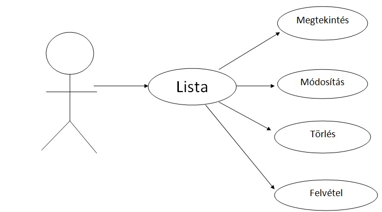
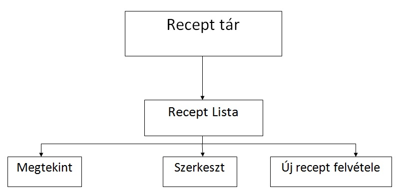
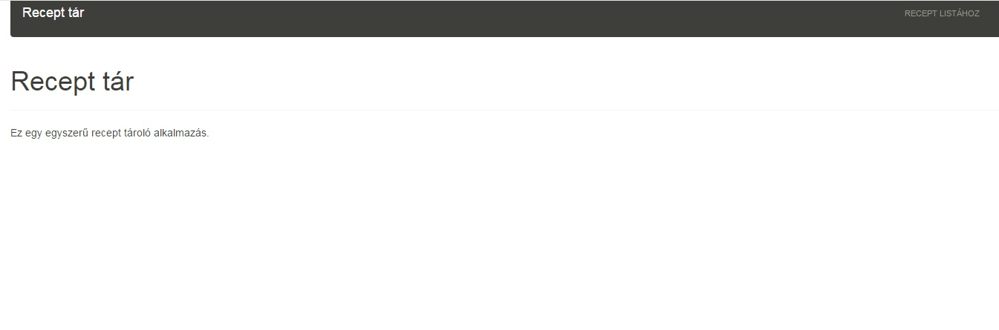
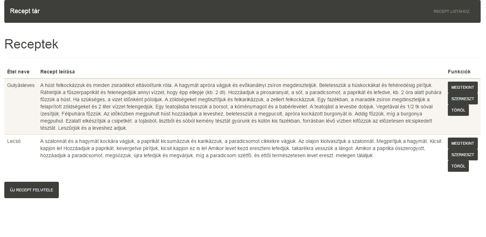
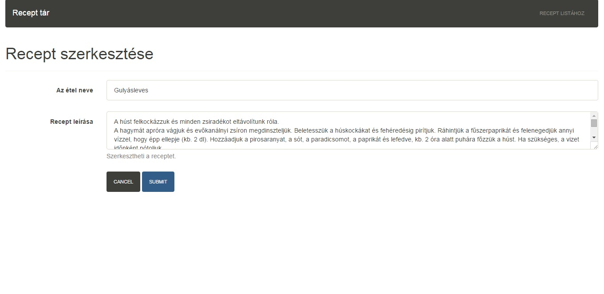
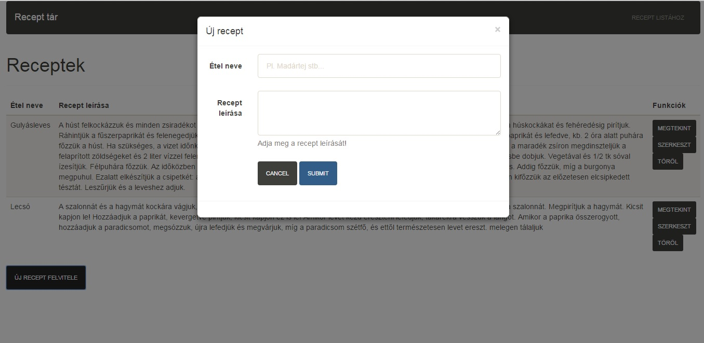
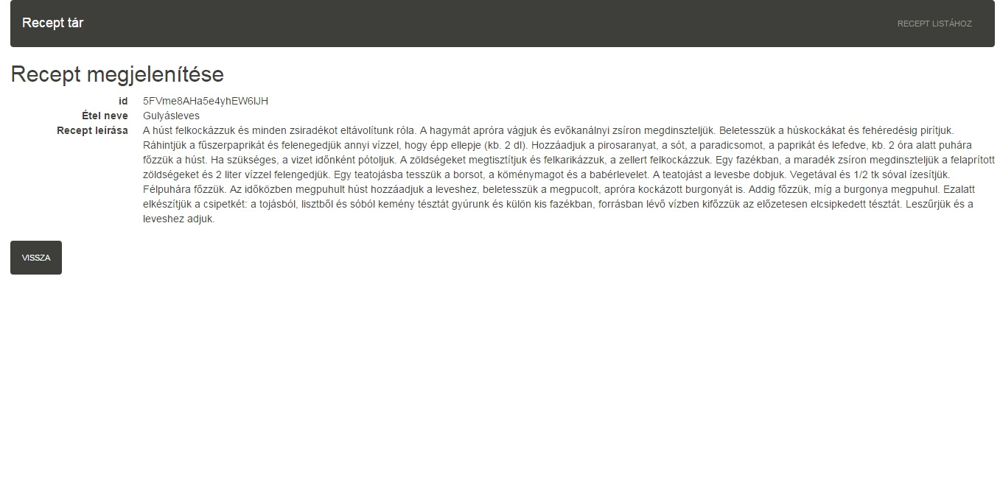
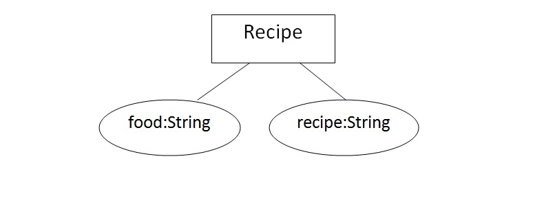
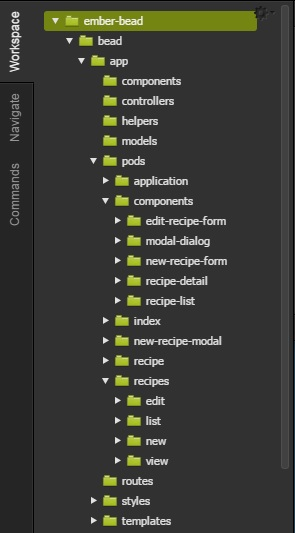
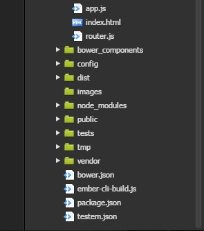

#2. beadandó dokumentációja

##1. Követelmény analízis

**Funkcionális elvárások:**

A webes alkalmazás amit készítünk egy egyszerű recept tár program. A programnak kell lennie egy lista oldalnak, ahol az összes recept látható. Erről az oldalról lehetőségünk van az egyes recepteket megtekinteni, szerkeszteni és törölni, illetve új recepteket felvenni. Az új recepteket egy felugró ablakban tudjuk felvenni, egy receptet szerkeszteni pedig egy külön oldalon. A lista oldalon minden recepthez tartozik továbbá egy "megtekint" funkció, melynek segítségével megtekintehő a recept teljes leírása.

**Nem funkcionális követelmények:**

Az alkalmazást vastagkliens alkalmazásként valósítjuk meg ember js segítségével. Az adatbázisunk egy Rest api-t használó távoli adatbázis szerver.

**Szakterületi fogalomjegyzék:**

- recipe: Az adatbázisban tárolt receptek elnevezése.
- ember js: vastagkliens alkalmazás technológia, a program alapja
- REST API: (Representational State Transfer) egy szoftverarchitektúra típus, elosztott hipermédia rendszerek számára

**Használati eset modell:**

Szerep körök:

A program recipe típusú adatokat tárol egy távoli szerveren amik a program megnyitása után elérhetőek a felhasználók számára. Az oldalra a regisztráció, így a belépés sem lehetséges, nincsenek egyedi user felületek.

Használati eset diagram:

Egy folyamat ismertetése:

A felhasználó a program használatakor először egy üdvözlő oldalra kerül, innen elérjük az összes receptet egy oldalon listázva. Minden recepthez tartozik egy szerkesztés, egy törlés gomb és egy megtekintés gomb. A szerkesztés gombra kattintva az adott receptet tudjuk módosítani. Ha elmentettük a módosításokat akkor visszakerülünk a lista oldalra, ahol már a módosított adatokkal jelenik meg a recept. A törlés gomb megnyomásával törölhetünk egy receptet a listából. A megtekintés gomb segítségével az adott recept részleteit láthatjuk. A lista oldalon lehetőségünk van bővíteni az adatbázist új recept felvételével, ezen gomb megnyomásával egy új ablak ugrik fel. Ha elmentettük a frissen felvett receptet, akkor visszakerülünk a lista oldalra. 

##2. Tervezés

**Architecktúra terv:**

Az alkalmazás egy Javascript alapú HTML, ember js, bower, bootstrap technológiákat használó program. A kliensoldali alkalmazás alapját az app mappában lévő router.js (ebben találhatóak az oldal végpontjai) és a végpontokhoz tarozó, a pods mappában tárolt template.hbs, route.js és controller.js file-ok alkotják.

Oldal térkép:

Végpontok:

- about                     Az oldal készítőjének adatai
- recipes/list                A listázó oldal
- recipes/new                 Az új recept felvétele oldal
- recipes/edit/:recipe_id       A recept szerkesztése oldal
- recipes/delete/:recipe_id     A recept törlése oldal
- recipes/view/:recipe_id       A recept megtekintése  

**Felhasználóifelület-modell**

Oldal vázlatok:

Első oldal:

Lista oldal:

Szerkesztő oldal:

Új recept felvétele oldal:

Recept megtekintése oldal:

**Adatmodell**

##3. Implementálás

Fejlesztői környezet:

A fejlesztés a cloud 9 felületén zajlott.

Mappa szerkezet:

- .tmp: itt tároljuk file-ban az adatokat
- config: a waterline configurációját tároljuk itt
- controllers: a végpontok controllerei
- models: az adatbázik modelljét leíró file-ok és a teszt file-ok
- node_modules: a különböző node modulok
- public: bootswatch, bootstrap, jquery
- views: az oldalak megjelenésért felelős hbs file-ok
- images: a dokumentációban használt képek

##5. Felhasználói dokumentáció

Futtatási követelmények:
- Egy javascript futtatására alkalmas böngésző
- Operációs rendszeres tetszőleges
- 2db Cloud9-os workspace
